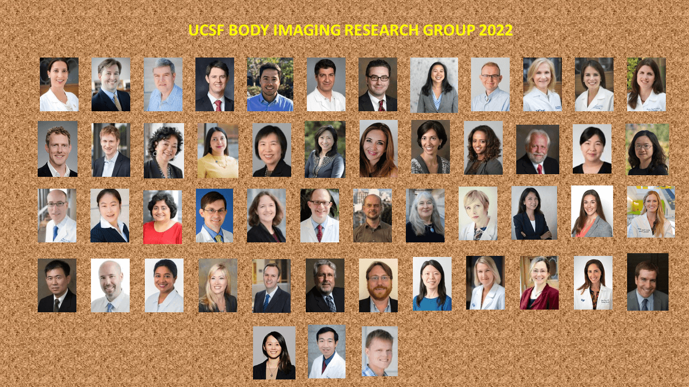

The Body Imaging Research Group includes a broad range of experts on all types of medical imaging who use these techniques to study the abdomen, pelvis, breasts, and musculoskeletal system to improve our understanding of their fundamental and holistic role in health, and how to prevent and heal damage to the body.

## Who we serve
Research lead by the UCSF Body Imaging Research Group will translate to healthier futures for:

* Patients suffering from complications caused by fatty liver disease, diabetes, or obesity, as well as related metabolic disorders
* Patients who are suffering from diseases in the bones and joints, such as osteoarthritis, osteoporosis, chronic back pain
* Patients who are at risk for cancer of the breast, abdomen and pelvis who can be assisted in their diagnostic process
* People with cancers of the body, such as breast, prostate, and renal cancer, where we help individualize treatment for better outcomes and reduced side effects

## Conditions we address
The clinical application of our body imaging research will help manage:

* Prostate cancer
* Breast cancer
* Liver conditions
* Kidney conditions
* Osteoporosis and osteoarthritis
* Chronic Pain
* Uterine fibroids
* Diabetes
* Metabolic disorders
* Cancers of the abdomen and pelvis
* Metastatic disease

## Who we partner with
Our research is enabled by the connections that are essential to advance shared goals of advancing human health:

* Patients and their families
* Researchers from our own and other institutions
* Education and training programs to develop the next generation of scientists
* Industrial partners making advances in imaging available worldwide
* Visionaries who seek to serve the populations we do
* Donors committed to improving the lives of others

## Who we are

The Body Imaging Research Group is made up of a diverse group of scientists, engineers, and clinicians whose teams include faculty members, staff scientists, research assistants, postdoctoral fellows, medical and graduate students, and clinical research coordinators.