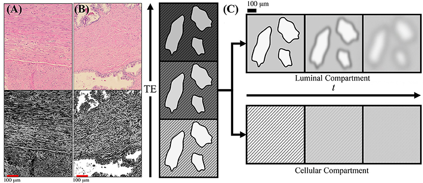
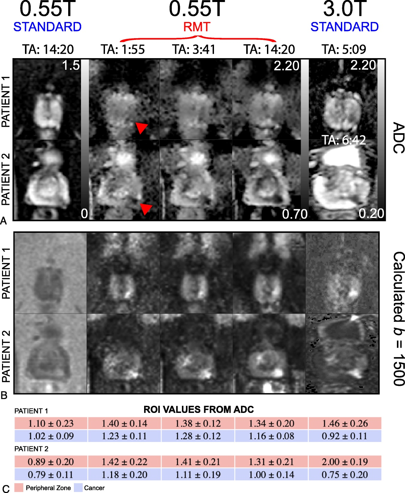

“Which microstructural features contribute to changes in diffusion and T2 as prostate cancer progresses?”

Dr. Gregory Lemberskiy shared with a very impressive body of work, digging deep into the sources of both T2 and diffusion contrast in prostate cancer MRI.  Dr. Lemberskiy is the chief executive officer of MICSI, which is focused on bringing microstructure imaging into clinical practice. Dr. Lemberskiy holds a PhD in Biomedical Imaging from the NYU Grossman School of Medicine, where his research focused on enabling MRI as a non-invasive complement to the Gleason grading system through the combination of image processing and biophysical modeling of diffusion MRI in prostate tissue.

The foundation of this was assuming that there are multiple signal sources, and dividing this into "cellular" and "luminal" components.  The cellular component has typically shorter T2~50 ms and more restricted diffusion.  The luminal component has much longer T2~450 ms and typically less restricted diffusion.  The T2w probes the fractions of these components, while DWI is sensitive to the fractions and the diffusivities, providing complimentary information.  A major take-home for me was that the choice of TE in both T2 and diffusion will impact the weighting between these components, so becomes a very important parameter to choose.

Characterization of Prostate Microstructure Using Water Diffusion and NMR Relaxation: https://www.frontiersin.org/articles/10.3389/fphy.2018.00091/full

Dr. Lemberskiy also showed that much of the characterization work leveraged advanced denoising via Random Matrix Theory (RMT).  This method jointly denoising all different b-value and diffusion direction images, leveraging shared information.  It also has shown great success in the brain.

Finally, there was a lot of interest in 0.55T MRI prostate MRI results Dr. Lemberskiy showed, where use of RMT denoising was also instrumental in improving diffusion to reasonable (~5 minutes) scan times.

Feasibility of Accelerated Prostate Diffusion-Weighted Imaging on 0.55 T MRI Enabled With Random Matrix Theory Denoising:
https://journals.lww.com/investigativeradiology/fulltext/2023/10000/feasibility_of_accelerated_prostate.3.aspx?context=featuredarticles&collectionid=6

It will be interesting to follow this work, and in particular Dr. Lemberskiy's startup MICSI (https://www.ycombinator.com/companies/micsi) that aims to improve microstructure imaging for clinical practice so could become a tool we use in the future.

My remaining questions for prostate MRI diffusion in particular are how to do critical evaluation of the approach presented as well as other new frameworks such as RSI and VERDICT.

Dr. Lemberskiy publications https://scholar.google.com/citations?user=_TvugCIAAAAJ

