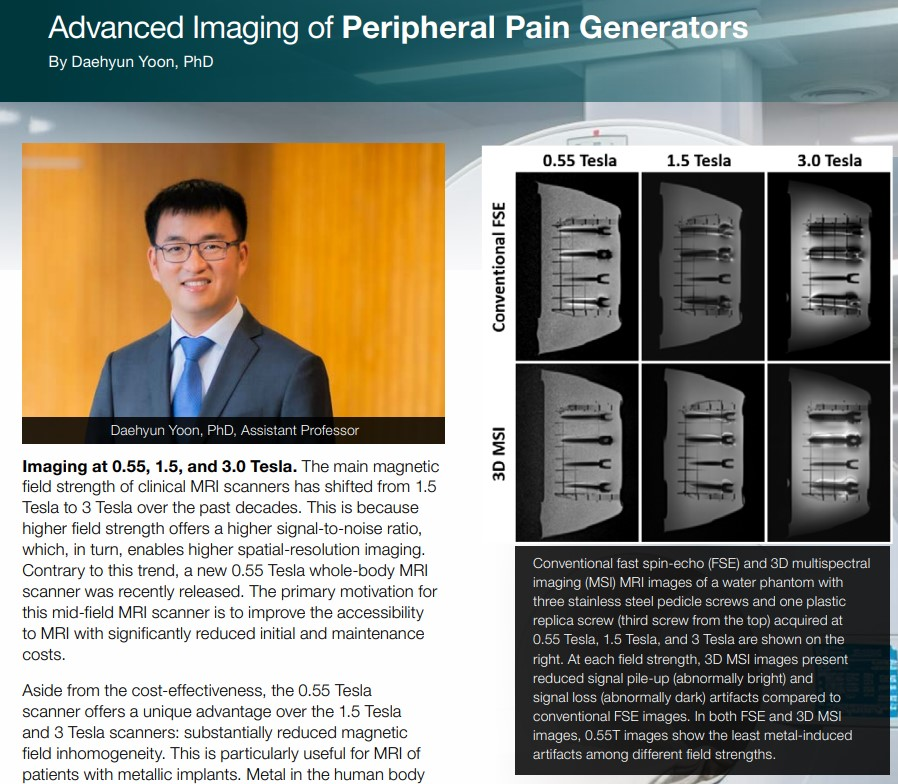
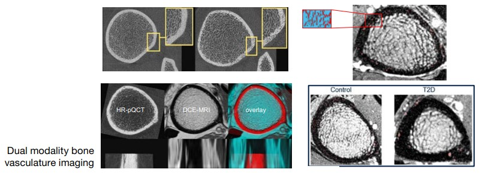

An update on the activities of Body Imaging Research Group members was published in the UCSF Radiology and Biomedical Imaging's annual magazine, IMAGES.

Check out features on the research of Prof. Daehyun Yoon "Advanced Imaging of Peripheral Pain Generators" and Prof. Galateia Kazakia "Imaging Cortical Bone Vasculature"!

[Full Magazine](https://radiology.ucsf.edu/news/dept-publications)

[Body Imaging Research Group Articles](../assets/docments/MGZN-UCSF-Radiology-Images-2023.pdf)

