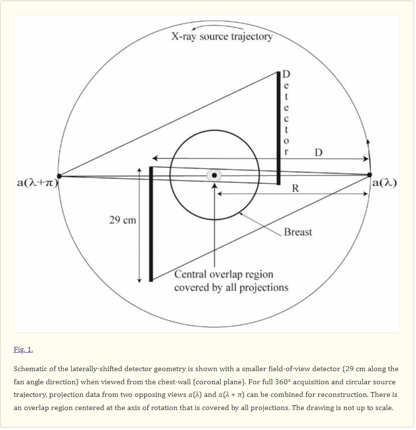
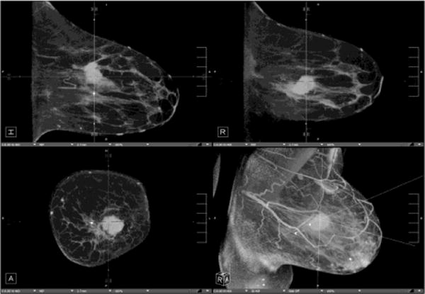

Bruce Hasegawa Memorial Lecture:
"Dedicated Breast CT: Towards Clinical Translation for Breast Cancer Screening"

Dr. Srinivasan Vedantham, PhD, from the 
Department of Medical Imaging at
University of Arizona
gave an inspiring lecture advocating for the use cases of CT for breast cancer imaging.  This is not a new idea, and he showed original scanners designed in the 70s.  The idea has been revisited in the past decade or so as imaging has become a more and more powerful tool for breast cancer.

Beyond 2D Xray mammography, now digital breast tomosynthesis (DBT) I belive is largely the modality of choice for screening and diagnosis.  It is like a mini or partial CT, acquired a limited range of projections.  Dr. Vedantham has led development of true CT systems dedicated to breast imaging that acquire a full or nearly full range of projects.  It has distinct advantages of being able to fully resolve spatial features and ideally reduce recall rates.  They see an especially advantageous use case for dense breasts where detection is particularly tricky.

An overivew of breast CT with example clinical use cases is found in "Newer technologies in breast cancer imaging: Dedicated cone-beam breast CT" <https://www.ncbi.nlm.nih.gov/pmc/articles/PMC5957539/>

Breast CT has approved for diagnositic imaging, but he discussed how it is hard for most institutions to justify a dedicated machine for breast cancer diagnosis alone.  Thus, his new target is screening.

Several requirements outlined for screening are using low dose (< 6 mGy) to be comparable to 2-view mammography and not requiring contrast.  His team has done impressive work using 
unique imaging geometries and image reconstruction methods to achieve these targets as well as integrating into clinical trials to prove performance.

I found this talk to be quite inspiring in how Dr. Vedantham has considered the imaging system design, image reconstruction methods, and clinical use cases, all done in partnership with clinicians and industrial partners (GE Healthcare).  I think this perspective is extremely productive for biomedical imaging science.

Dr. Vedantham's Summary: The top 10 reasons we need CBCT
1. It is the next technical improvement after mammography and tomosynthesis have reached their limits.
1. One “view” only per breast, then we can “manipulate the image not the patient”.
1. It is better for dense breasts (eliminates overlap).
1. Reduces false positives and false negatives.
1. Better resolution than MRI (CBCT can visualize calcifications).
1. Ease of contrast administration.
1. Less costly to perform.
1. Shorter time to peform than diagnostic mammography and MRI.
1. Improved patient comfort-no compression.
1. More acceptable to many patients for cultural and privacy reasons.

Dr. Vedantham publications <https://scholar.google.com/citations?user=Y4WfyHYAAAAJ&hl=en&oi=sra>

